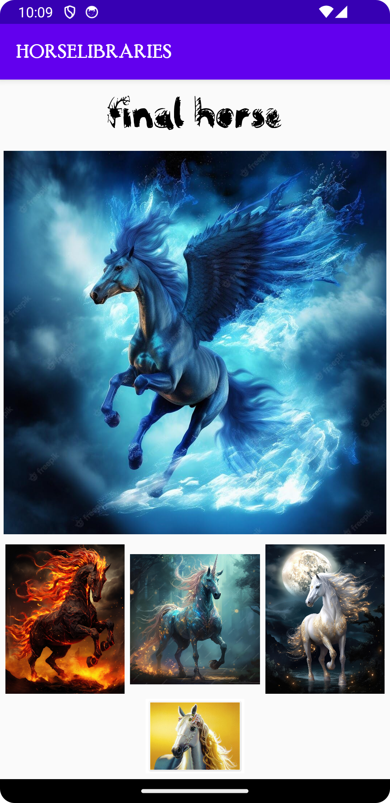

# Rapport

Jag började med att implementera Picasso som ett externt bibliotek. Detta bibliotek gör det möjligt att
länka in externa bilder i ImageView. Genom att lägga in följande kod i build.gradle så fick jag tillgång
till de funktioner som biblioteket erbjuder:
```
implementation 'com.squareup.picasso:picasso:2.71828'
```
Därefter skapades ett antal ImageViews i layouten som sedan deklareras som private fält i MainActivity
```
private ImageView queenHorseView, horseOneView, horseTwoView, horseThreeView, horseFourView;
```
För att länka in externa bilder i mina ImageView så används följande kod som hämtar hem bilden
via .load() och sparar den lokalt innan den visas .into().
```
Picasso.get()
       .load(url1)
       .into(queenHorseView);
```
url har jag valt att lägga i en sträng för att få en "snyggare" kod.
```
String url1 = "https://m.media-amazon.com/images/I/71FQu2QB0eL._SL1060_.jpg";
```

För att experimentera ytterligare så sökte jag reda på ett externt bibliotek som gör det möjligt att
ändra till en egenvald font. Genom att implementera Calligraphy 3 biblioteket kan jag nu ladda ner 
valfri font, lägga det i en asset-folder och sen länka in vald font som default i appen och/eller
ändra font i layout xml-filen. Följande lades till i build.gradle för att ladda hem biblioteket.
```
implementation 'io.github.inflationx:calligraphy3:3.1.1'
implementation 'io.github.inflationx:viewpump:2.0.3'
```
Följande kod läggs i onCreate() för att sätta egen default-font i appen:

```
ViewPump.init(ViewPump.builder()
        .addInterceptor(new CalligraphyInterceptor(
            new CalligraphyConfig.Builder()
                .setDefaultFontPath("hobby-horse.ttf")
                .setFontAttrId(R.attr.fontPath)
                .build()))
        .build());
```

Följande läggs innan onCreate:

```
protected void attachBaseContext(Context newBase) {
    super.attachBaseContext(ViewPumpContextWrapper.wrap(newBase));
}
```

